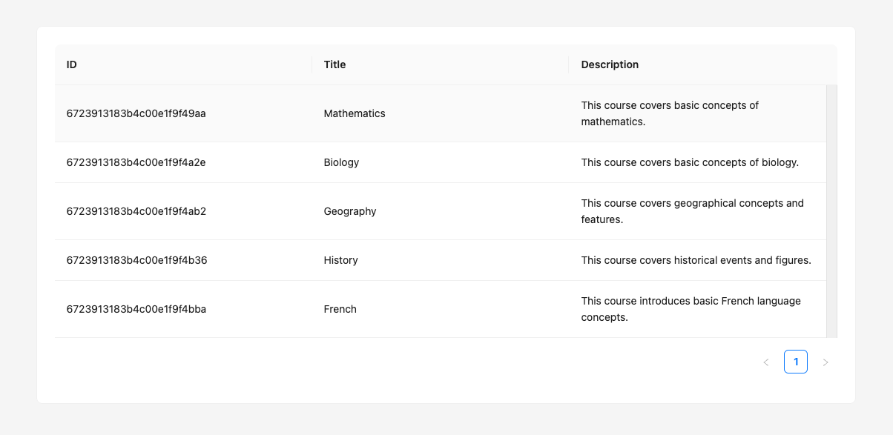
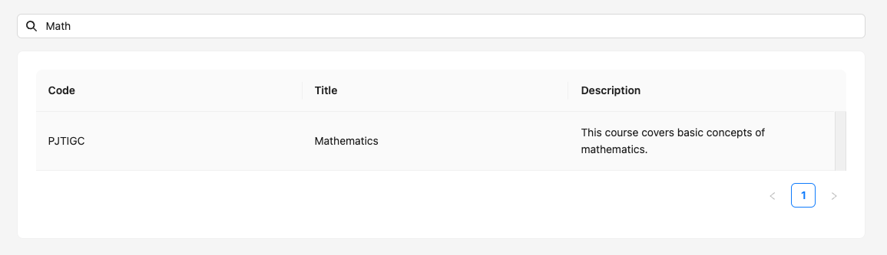

# Fullstack intern test case of Eliana Yepez.

## Introduction

n this exercise, I had to conduct research on various tools like ChatGPT, Stack Overflow, and the official documentation from MongoDB, Node, Express, and React. I also discovered Ant Design UI and its versatile components, which I am curious to continue exploring.

## GitHub submission

I decided to work with GitHub for its flexibility and clearer source and version control for the exercise.

I created two branches from master: a development branch, which is the one I am mainly working on, and an esm-migration branch, which I created with the intention of migrating from CommonJS to ES modules.

Since the files were originally using CommonJS, I decided to continue working with it and verify, based on the app’s development needs, when to migrate.

## Tools

I have installed Docker on my machine. I have also installed the MongoDB extension in my IDE (VS Code), Postman to verify my route URLs, and additional tools like Prettier for clean and readable code.

I had changed my docker-compose.yml file to work with a .env file, but I decided to continue using the existing volumes and made changes in response to the project's future need for additional security measures.

## Run the project on your localhost

- Start Docker Desktop on your machine

- Launch the Docker container from the project

  ```bash
  docker compose up -d
  ```

- Install dependencies

  ```bash
  npm install --prefix apps/api
  npm install --prefix apps/web
  ```

- In a new terminal, start the backend API

  ```bash
  npm run start:api
  ```

> [!NOTE]
> The Mongo database is empty when you start the server.
>
> To populate some data in it, please run the following command in a terminal:
>
> ```
> npm run seed
> ```

- API should run on port `3000`
- You can test the API by going to `http://localhost:3000/api/health`
- You can check the state of your MongoDB database with your MongoDB client, using the connection string that's available in `server.js`

- In another terminal, start the frontend WEB

  ```bash
  npm run start:web
  ```

### Step 1 - add a description

#### Backend

We would like to add a description to the courses.
This description should have a limit of 256 chars.

Once you have added the description property, you can populate data again by running the seed with the command:
npm run seed

#### Frontend

We now want that description to appear as a third column in the courses list page.
Update the Course model and the CourseList component to display this new column.
You should end up with this result:



### My Code :

#### Backend

In this step, I updated the CourseController to fetch a specific course by its ID. In the course schema, I declared the type of the description field and set a maximum length of 256 characters to limit the description. I also defined the Question schema, specifying its type and reference. Additionally, I defined the DataTypes for ID, title, and description.

#### Frontend

I created space for this data to be visible in the existing CourseList.tsx component on the web app by adding the columnsTypes and its items:

{
title: 'Description', // Added Description column
dataIndex: 'description', // Data is fetched from the `description` field
key: 'description',
}
This ensures that the description field is properly displayed as a column in the course list

### Step 2 - hide unnecessary data

#### Backend

Some of the data that's stored in DB are useless for the client so we would like to avoid returning these data in the API.  
Update the API code to return only the following information when call `GET /api/courses`

```json
{
  "_id": "672cba3267f16b1cce31904f",
  "title": "General Chemistry: Principles and Applications",
  "description": "An overview of fundamental chemistry concepts such as atomic structure..."
}
```

#### My Code :

I modified the CourseController to fetch only the \_id, title, and description fields, removing unnecessary data. The CourseController calls the courseModel, uses the find method, and selects the specified fields based on the provided fetch parameters.

### Step 3 - use a human-readable identifier

#### Backend

We don't want to expose the technical `_id` to teachers, because it's not a human-readable identifier for a course.  
We would instead like to generate a random `code` of 6 letters for each course.

Update the Course logic in the API to implement this new `code` property.  
Your implementation will need to follow these constraints:

1. The `code` is provided by the API when:
   - We list the courses.
   - We get the details of a course.
2. We can not modify this `code` via the API update endpoints.
3. The `code` property is indexed by MongoDB so we can efficiently use it to search for courses.
4. The `code` should be unique.

> [!NOTE]
> Once you have added the `code` property, you can populate data by running the seed with the command:
>
> ```
> npm run seed
> ```

#### Frontend

Now that the API also sends a `code` for each course, replace the `id` by this new `code` in the course list.

#### My code :

I modified the course-schemas and created a function to generate a random 6-character code. This change updated the CourseController endpoint for creating a course to ensure that a unique code is generated for each course.

### Step 4 - search for a course

#### Backend

We would like to quickly and easily retrieve a course.  
To do it, we would like to provide an API endpoint able to search courses by their `code` or their `title`.

The search logic should follow these rules:

- The search should be case-insensitive.
- The search should be a partial match: you can get results by typing any part of the course `code` or `title`.

You can implement search either by updating the endpoint `GET /api/courses` or by creating a new, specific endpoint.

#### Frontend

Now that you have a working search endpoint, it's time to use it to search in the list of courses.  
Uncomment the search input above the list of events and implement the search logic to use your newly implemented search API endpoint.

To keep the page simple, we'll avoid adding a search button and send the request to the API on each keystroke.

You should end up with this result:



#### My code :

To allow users to search for a course by its code or title, I updated the course-service to handle this functionality, modified the CourseController, and added a new endpoint to the routes. The course code serves as a user-friendly identifier, but courses can still be found by their ID on the database.

### Step 5 - course detail page

#### Frontend

You may have already noticed that clicking on a course moves you to a new page and displays a 404 error.  
Add the missing routing logic to display the course detail page when clicking on a course.

Since we don't want to expose the technical `_id` to teachers, we will use the `code` to identify the course in the URL.  
Update the existing redirection logic to use the `code` instead of the `_id`.

> [!NOTE]
> If you didn't complete step 3, you can still use the `_id` to identify the course in the URL.

#### My code :

I’ve added the router logic to navigate from the CourseList to the CourseDetails page when clicking on a course. To enable this navigation, I implemented a course-controller that allows us to identify each course by its unique code in the URL. This makes it possible to dynamically load and display the course details in the CourseDetails page, ensuring that the correct data is fetched and presented when a user selects a specific course from the list.

### Step 6 - display course questions

We would like to display the course title, description and its list of questions.

Since we previously removed the unnecessary data from the courses list API response, we'll need to call the API again to get the course's questions.

#### Backend

Remember we chose not to expose technical IDs to users ? This means we'll need to have a way to fetch the course by its code.

Please update the API endpoint `GET /api/courses/:courseId` to load the detail of a course by its code.

> [!NOTE]
> If you didn't complete step 3, also skip the backend part for this step (step 6).

#### My code :

I have modify course-service to include question on the getByCode fucntion. On CourseDetails I needed to map() all the questions and change the index in the key of the list, so we could idetify each question by its id and not by its index.

#### Frontend

Fetch the course details using the logic you just implemented.

> [!NOTE]
> If you skipped the backend part for this step (step 6), you can still use the `_id` to fetch the course details.

Then, display the course title, its description, its list of questions and a button to go back to the list of courses.

You should end up with this result:


#### My code :

I’ve modified the course-service to include questions when fetching a course using the getByCode function. In the CourseDetails component, I then mapped over all the questions and changed the key in the list from the index to the question's unique ID. This ensures that each question is uniquely identified by its ID instead of relying on the index, which improves performance and avoids potential issues when rendering dynamic lists.

### Step 7 - edit course questions

#### Frontend

Now, modify the course details page to open an edition modal when clicking on a question in the list.  
This modal should allow the user to edit the question's name and choices.

The API already provides the necessary endpoint to update a question. Find which one it is, and use it to save the edited data.

#### My code :

This may be the most difficult step I've encountered. I had problems with fetching the data, but later I realized it was a small routing issue. TypeScript types were also blocking my understanding of the PATCH method and modifying only the changed text. I spent some time looking for a way to render the questions with the modal. I found some deprecated methods in Ant UI, but I also spent a good amount of time understanding that I needed to fetch the courses first by code and then get the ID of each specific question to display it in the modal from Ant UI.

I encountered problems with CORS and discovered that I could change some of the anonymous function methods, but I preferred to focus on making the PATCH method work and refactoring the functions to improve naming.

### Step 8 - duplicate a question

Creating questions can be time-consuming for our users. We would thus like to give them the possibility to duplicate an existing question in a specific course.

Implement the following API endpoint:
`PUT /api/courses/:courseId/questions/:questionId/duplicate`

Now, add a duplicate button on each question in the course detail page.  
When clicking on this button, the question should be duplicated in the same course and the duplicated question should appear immediately in the list.

#### My code :

I didnt finish this step. I will come back for it!

### Step 9 - log all requests

For monitoring purposes, we want to log all the requests which are made to our API.

Update the API codebase to log the content of each request that the API receives, following the instruction below:

1. A simple `console.log` is enough for logging.
2. Each log, needs to include:
   - the request's HTTP method.
   - the request's URL, including query parameters.
   - the request's body, if present.

#### My code :

I have logged several requests, but I didn't finish this step. I will come back for it!
